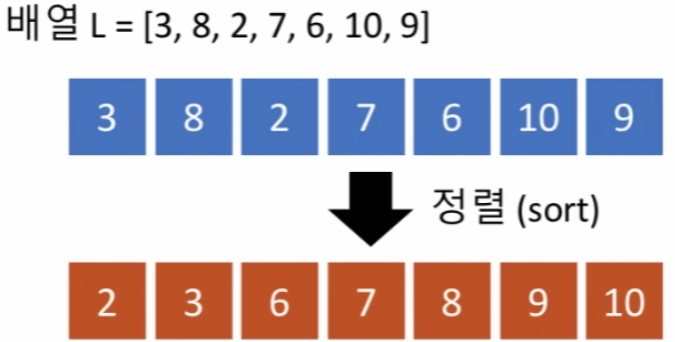
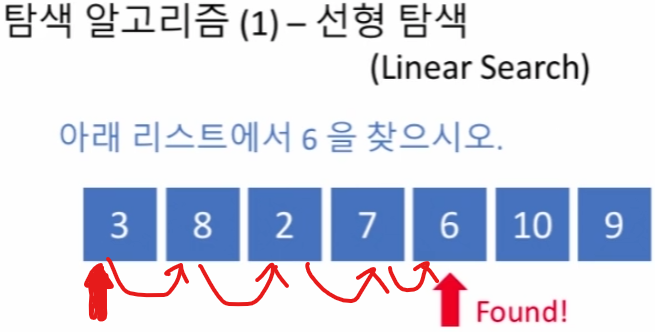
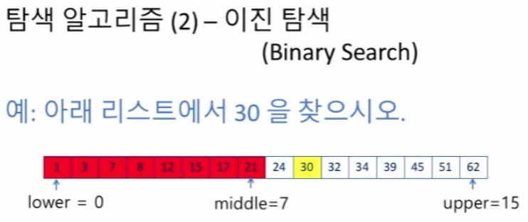
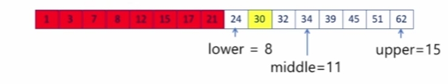
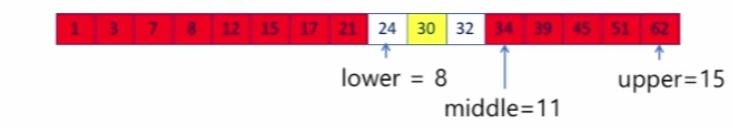
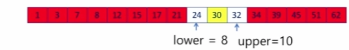
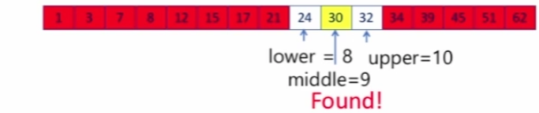
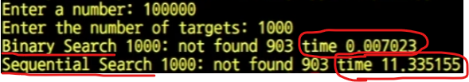
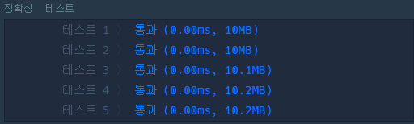
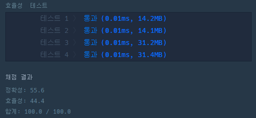

<head>
  <style>
    table.dataframe {
      white-space: normal;
      width: 100%;
      height: 240px;
      display: block;
      overflow: auto;
      font-family: Arial, sans-serif;
      font-size: 0.9rem;
      line-height: 20px;
      text-align: center;
      border: 0px !important;
    }

    table.dataframe th {
      text-align: center;
      font-weight: bold;
      padding: 8px;
    }

    table.dataframe td {
      text-align: center;
      padding: 8px;
    }

    table.dataframe tr:hover {
      background: #b8d1f3; 
    }

    .output_prompt {
      overflow: auto;
      font-size: 0.9rem;
      line-height: 1.45;
      border-radius: 0.3rem;
      -webkit-overflow-scrolling: touch;
      padding: 0.8rem;
      margin-top: 0;
      margin-bottom: 15px;
      font: 1rem Consolas, "Liberation Mono", Menlo, Courier, monospace;
      color: $code-text-color;
      border: solid 1px $border-color;
      border-radius: 0.3rem;
      word-break: normal;
      white-space: pre;
    }

  .dataframe tbody tr th:only-of-type {
      vertical-align: middle;
  }

  .dataframe tbody tr th {
      vertical-align: top;
  }

  .dataframe thead th {
      text-align: center !important;
      padding: 8px;
  }

  .page__content p {
      margin: 0 0 0px !important;
  }

  .page__content p > strong {
    font-size: 0.8rem !important;
  }

  </style>
</head>


## 정렬과 탐색(Sorting & Searching)


#### 00. 들어가기에 앞서

  

- 람다함수(lambda)

    - 런타임에서 생성, 사용할 수 있는 익명 함수

    - 주로 filter(), map(), reduce()와 같은 전형적인 기능 개념과 함께 사용

    - 쓰고 버리는 일시적인 함수

        - 함수가 생성된 곳에서만 필요

        - 간단한 기능을 필요한 곳에서 즉시 사용하고 버림

  

- 람다의 정의

```py

lambda [인자리스트]: [표현식]

```


    - return문 포함하지 않음

    - 반환값은 표현식에 의해 만들어짐


```python
# 활용 예시

def inc(n):
    return lambda x: x + n
   
f = inc(2)
g = inc(4)
```


```python
print(f(12))
# 14 (2 + 12)
print(g(12))
# 16 (4 + 12)
print(inc(2)(12))
# 14 (2 + 12)
```

<pre>
14
16
14
</pre>
*기능 함수와 같이 쓰는 Lambda*


- 1. map() : 내장 함수

    - 2개의 인자

    - function을 iterable의 모든 요소에 대해 적용

    - function에 의해 변경된 iterator 반환

```py

map(function, iterable)

```


```python
a = [1, 2, 3, 4]
b = [13, 16, 17, 14]
list(map(lambda x, y: x + y, a, b))
```

<pre>
[14, 18, 20, 18]
</pre>
- 2. filter() : 내장 함수

    - 2개의 인자

    - interable의 각각의 요소에 대해 Boolean 값 반환

    - True면 남고, False면 제거

```py

filter(function, iterable)

```


```python
a = [2, 18, 9, 22, 17, 24, 8, 12, 27]
list(filter(lambda x: x % 3 == 0, a))
```

<pre>
[18, 9, 24, 12, 27]
</pre>
- 3. reduce() : **외장** 함수

    - 2개의 필수 인자와 하나의 옵션 인자

    - function을 사용해서 iterable을 하나의 값으로 줄인다는 개념

    - Initializer : 첫 번째 인자로 추가됨

```py

functools.reduce(function, iterable[, initializer])

```


```python
from functools import reduce
reduce(lambda x, y: x + y, [1, 2, 3, 4, 5], 1)
```

<pre>
16
</pre>
#### 01. 정렬(Sort)


- 정렬이란?

    - 복수의 원소로 주어진 데이터를 **정해진 기준**에 따라 새로 늘어놓는 작업

    


```python
L = [3, 8, 2, 7, 6, 10, 9]
```

- Python 리스트의 정렬 1. sorted()

    - 내장 함수(built-in function)

    - 정렬된 새로운 리스트를 얻어냄

    ```py

    sorted(function)

    ```


```python
sorted(L)                     # 오름차순
```

<pre>
[2, 3, 6, 7, 8, 9, 10]
</pre>

```python
sorted(L, reverse = True)    # 내림차순(Reverse : 역순 정렬)
```

<pre>
[10, 9, 8, 7, 6, 3, 2]
</pre>
- Python 리스트의 정렬 2. sort()

    - 리스트이 메서드(method)

    - 해당 리스트를 정렬

    ```py

    list.sort()

    ```


```python
L.sort()                   # 오름차순
L
```

<pre>
[2, 3, 6, 7, 8, 9, 10]
</pre>

```python
L.sort(reverse = True)    # 내림차순(Reverse : 역순 정렬)
L
```

<pre>
[10, 9, 8, 7, 6, 3, 2]
</pre>
- 문자열로 이루어진 리스트의 경우

    - 정렬 순서 : 사전 순서(알파벳 순)

    - 대문자를 소문자보다 우선

    - 문자열의 길이 = 크기 X

        - 문자열 길이 순서로 정렬하는 법 : 정렬에 이용하는 **키(key)** 지정(길이를 키로 지정)


```python
L = ['abcd', 'xyz', 'spam']
```


```python
# 문자열의 길이 순으로 정렬
sorted(L, key = lambda x: len(x))    # lambda 를 사용, 정렬의 키를 지정
# 같은 길이라면 원래의 순서를 적용
```

<pre>
['xyz', 'abcd', 'spam']
</pre>
- 정렬에서 키를 지정하는 또 다른 예


```python
L = [{'name' : 'John', 'score' : 83},
      {'name' : 'Paul', 'score' : 92}]
```


```python
L.sort(key = lambda x: x['name'])    # 레코드들을 이름의 알파벳 순서대로 정렬
L
# 레코드? : 여러 데이터의 복합으로 이루어진 데이터 원소
```

<pre>
[{'name': 'John', 'score': 83}, {'name': 'Paul', 'score': 92}]
</pre>

```python
L.sort(key = lambda x: x['score'], reverse = True)    # 레코드들을 점수 높은 순서대로 정렬
L
```

<pre>
[{'name': 'Paul', 'score': 92}, {'name': 'John', 'score': 83}]
</pre>
#### 02. 탐색(Search)

    - 탐색이란?

        - 복수의 원소로 이루어진 데이터에서 특정 원소를 찾아내는 작업.


1. 선형 탐색 || 순차 탐색 (Linear Search || Sequential Search)

    - 리스트의 길이에 비례하는 시간 소요 : O(n)

    - 최악의 경우 : 모든 원소를 모두 비교

    


```python
# 선형 탐색 코드 구현

def linear_search(L, x):    # L : 탐색의 대상 리스트, x 찾으려고 하는 원소
    i = 0
    while i < len(L) and L[i] != x:    # L의 마지막 원소까지 검사하거나, 찾으면 멈춤
        i += 1
    if i < len(L):    # 리스트 내에 있으면
        return i     # 찾은 위치 반환
    else:            # 없으면
        return -1
```


```python
S = [3, 8, 2, 7, 6, 10, 9]
linear_search(S, 6)
```

<pre>
4
</pre>

```python
linear_search(S, 1)
```

<pre>
-1
</pre>

```python
S.index(6)    # index() 함수 : 선형탐색
```

<pre>
4
</pre>

```python
S.index(1)    # 리스트에 없는 요소를 탐색하면 ValueError
```

1. 이진 탐색(Binary Search)

    - 탐색하려는 리스트가 이미 정렬되어 있는 경우에만 적용 가능

    - **크기 순으로 정렬**되어 있다는 성질 이용!

    

    - lower, uppper, middle 생성 후, middle과 탐색값 비교

        - 탐색값 == middle : 탐색 완료

        - 탐색값 > middle : lower ~ middle 무시

        - 탐색값 < middle : middle ~ upper 무시

    

    

    

    

    - 한 번 비교가 일어날 떄마다 리스트 반씩 줄임(Divide & Conquer) : O(log n)

        - 분할정복(Divide & Conquer) : 기존의 문제를 해결하기 쉬운 단위로 나눠서 해결한 후 다시 합침


```python
# 이진 탐색 코드 구현
def binary_search(L, x):    
    lower = 0
    upper = len(L) - 1
    idx = -1
    
    while lower <= upper:
        middle = (lower + upper) // 2
        if L[middle] == x:
            return middle
            break
        elif L[middle] < x:
            lower = middle + 1
        else:
            upper = middle - 1
    return -1
```


```python
S = [1, 3, 7, 8, 12, 15, 17, 21, 24 ,30, 32, 34, 39, 45, 51, 62]
```


```python
binary_search(S, 30)
```

<pre>
9
</pre>

```python
binary_search(S, 31)
```

<pre>
-1
</pre>
3. 선형 탐색과 이진 탐색의 성능 차이

    - 10만개의 원소 중, 1000개의 숫자를 찾아보기

    - 결과(강사님의 예시)

    

    - 효율적인 자료구조, 알고리즘을 사용해야하는 이유 : 성능 차이

    - 무조건 이진 탐색이 옳은게 아니라, 때에 따라서는 선형 탐색이 더 나을 수 있음


#### 03. 과제

3강 실습([Link](https://programmers.co.kr/learn/courses/57/lessons/13775))


```python
def solution(L, x):
    lower = 0
    upper = len(L) - 1
    
    while lower <= upper:
        mid = (lower + upper) // 2
        if L[mid] == x:
            return mid
            break
        elif L[mid] < x:
            lower = mid + 1
        else:
            upper = mid - 1
    return - 1
```





