<head>
  <style>
    table.dataframe {
      white-space: normal;
      width: 100%;
      height: 240px;
      display: block;
      overflow: auto;
      font-family: Arial, sans-serif;
      font-size: 0.9rem;
      line-height: 20px;
      text-align: center;
      border: 0px !important;
    }

    table.dataframe th {
      text-align: center;
      font-weight: bold;
      padding: 8px;
    }

    table.dataframe td {
      text-align: center;
      padding: 8px;
    }

    table.dataframe tr:hover {
      background: #b8d1f3; 
    }

    .output_prompt {
      overflow: auto;
      font-size: 0.9rem;
      line-height: 1.45;
      border-radius: 0.3rem;
      -webkit-overflow-scrolling: touch;
      padding: 0.8rem;
      margin-top: 0;
      margin-bottom: 15px;
      font: 1rem Consolas, "Liberation Mono", Menlo, Courier, monospace;
      color: $code-text-color;
      border: solid 1px $border-color;
      border-radius: 0.3rem;
      word-break: normal;
      white-space: pre;
    }

  .dataframe tbody tr th:only-of-type {
      vertical-align: middle;
  }

  .dataframe tbody tr th {
      vertical-align: top;
  }

  .dataframe thead th {
      text-align: center !important;
      padding: 8px;
  }

  .page__content p {
      margin: 0 0 0px !important;
  }

  .page__content p > strong {
    font-size: 0.8rem !important;
  }

  </style>
</head>


## 재귀 알고리즘(Recursive Algorithms)


#### 01. 재귀함수

- 재귀함수(Recursive Algorithm)란?

    - 하나의 함수에서 **자신을 다시 호출**하여 작업을 수행하는 것

    - 생각보다 많은 종류의 문제가 재귀적으로(recursively) 해결 가능

    - CS(Computer Science) 분야에서 자주 사용

    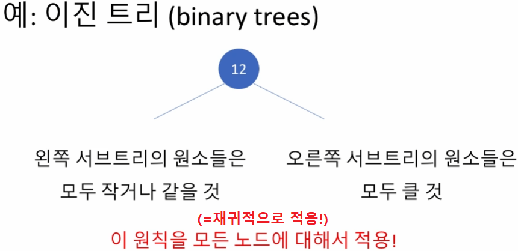

        - 이진 탐색과 비슷

    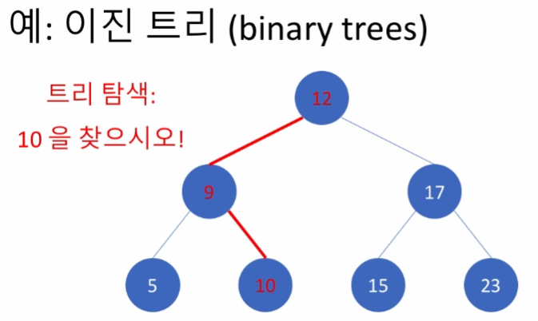

        - 이진 트리는 이진 탐색과 비슷한 흐름을 재귀적인 트리 알고리즘으로 구성

    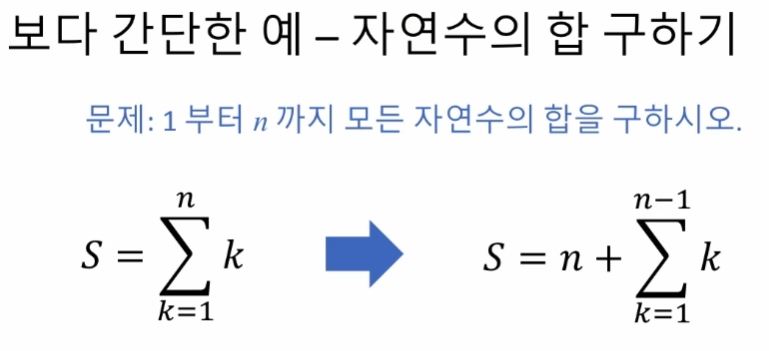

    

        - 함수 내에서 자기 자신을 호출


```python
# 자연수의 합 재귀 알고리즘(RecursionError)

def sum_num(n):
    return n + sum_num(n - 1)

sum_num(10)

# Maximum recursion depth exceeded
# RecursionError
# 음수영역까지 끝없이 재귀하기 때문
```


```python
def sum_num(n):
    print(n)    # 어떻게 실행되고 있는지 확인하기 위한 코드(디버깅)
    return n + sum_num(n - 1)

sum_num(10)
```

<pre>
10
9
8
7
6
5
4
3
2
1
0
-1
-2
-3
-4
(중략)
-2950
-2951
-2952
-2953
-2954
</pre>

```python
# 자연수의 합 재귀 알고리즘

def sum_num(n):
    print(n)
    if n <= 1:
        return n
    else:
        return n + sum_num(n - 1)
    
sum_num(4)
```

<pre>
4
3
2
1
</pre>
<pre>
10
</pre>
- 재귀 호출의 종결 조건(trival case)

    - 위 예제에서 확인했다 싶이 재귀 호출은 **종결 조건(trival case)**이 매우 중요

    - 일반적 구조

    ```py

    def function(x):

        if n ...:

            ...

            # 매우 중요!

        else:

            ...

            function(...)

    ```


- 재귀 알고리즘의 효율

    - 모든 재귀 알고리즘은 대칭되는(Counter-Part) 반복 알고리즘이 존재

    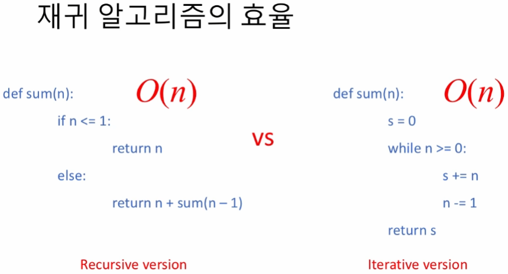

        - 시간복잡도 자체는 같으나 효율을 비교하면 다른 문제

        - 위 예시의 효율성

        - Reculsive Ver은 함수를 추가로 호출하는 부수적 동작 존재

        - 따라서 Iterartive Ver보다 효율성이 떨어진다고 볼 수 있음

        - 사람이 생각하는 방식을 표현하기에 유리하나

        - 효율적인 측면에서 떨어질 수 있음(**조심해야할 부분**)

    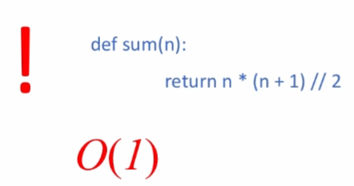

        - 극단적인 예 : 상수시간의 알고리즘

    - 생각보다 많은 문제가 재귀적으로 풀리긴 하지만

    - 또, 재귀적으로 표현된 알고리즘이 사람이 이해하긴 좋지만

    - 컴퓨터가 알고리즘 실행 시, 성능이 반드시 좋지는 않음

    - 효율적인 측면에도 유념해야하기 때문에 알고리즘, 자료구조 선택이 중요


```python
# 추가 예제(! - 팩토리얼)

def fac(n):
    print(n)
    if n <= 1:    # trival case
        return 1
    else:
        return n * fac(n - 1)
    
fac(5)
```

<pre>
5
4
3
2
1
</pre>
<pre>
120
</pre>
#### 02. 과제 : Fibonacci 순열


- Interative Ver VS Recursive Ver

    - 둘 다 작성해볼것.  

  

4강 연습문제([Link](https://programmers.co.kr/learn/courses/57/lessons/13776))


```python
# Interative Ver

def solution(x):
    l = [0, 1]
    if x >= 2:
        for i in range(2, x + 1):
            l.append(l[i - 1] + l[i - 2])
    return l[x]

solution(8)
```

<pre>
21
</pre>
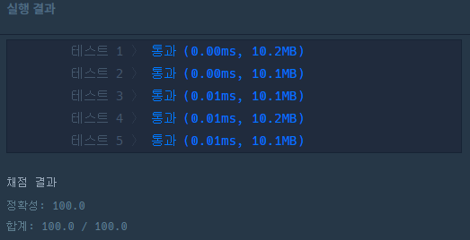


```python
# Recursive Ver

def solution(x):
    if x == 0:
        return 0
    elif x <= 2 :
        return 1
    else:
        return solution(x - 1) + solution(x - 2)

solution(8)
```

<pre>
21
</pre>
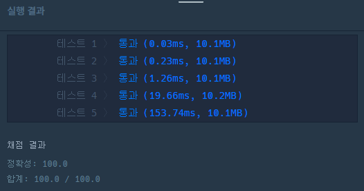


- 확실히 Interactive Version이 더 빠른 실행 결과로 통과했다.


```python
# Recursive Ver
# 강사님 코드
def fibo(n):
    if n <= 1:
        return n
    return fibo(n - 1) + fibo(n - 2)

fibo(8)
```

<pre>
21
</pre>
#### 03. 재귀함수의 유용성

- 재귀 알고리즘을 통해 다음 문제 해결

    - 조합의 수(n 개의 서로 다른 원소에서 m개를 택하는 경우의 수) 구하기

        - 재귀적이지 않은 방법으로 해결

    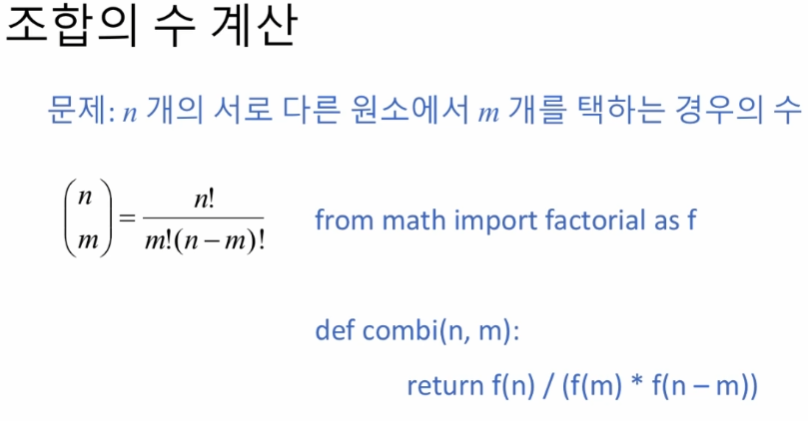

        - 재귀적으로 방법으로 해결

    

        - 잘못된 방법

    

        - 올바른 방법

    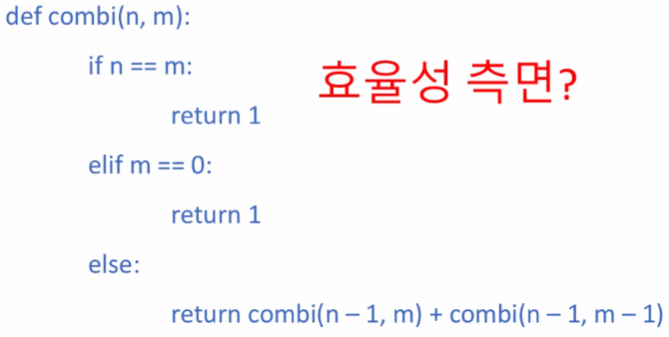

        - 하지만 효율성 측면에서는 여전히 좋지 않다

        - combi를 계속해서 호출하기 때문

        - 그렇다면 왜 재귀함수를 쓸까?


- 하노이의 탑 문제

    - 재귀 알고리즘이 효율은 떨어진다고 하더라도 사람이 생각하는 방식을 코드로 직접 옮김으로써 유용한 경우가 있다.

    - 그 대표적 예가 이 문제

    - 한 기둥의 원반들을 전부 다 다른 원반으로 옮기는 문제.

        - 단, 더 큰 원반은 더 작은 원반의 위로 올라갈 수 없음

    - 이 문제를 재귀적 알고리즘을 통해 해결하면 편함.

        - 나중에 한 번 해볼것!


```python
# 하노이의 탑 도전(작성 예정)
```

- 아주 많은 자료구조에 있는 문제 中 **트리**에 해당하는 문제는 재귀 알고리즘으로 푸는게 적당할 수 있음

    - 연습문제(빈칸채우기) : 재귀적 이진 탐색

    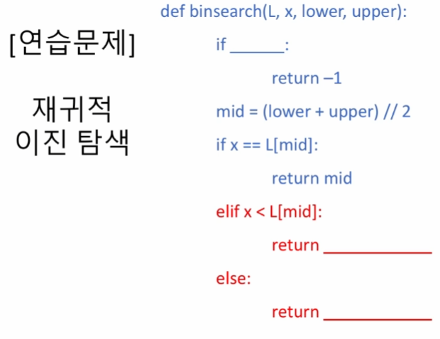


#### 04. 과제 2

5강 연습문제([Link](https://programmers.co.kr/learn/courses/57/lessons/13777))  


```python
def solution(L, x, l, u):
    if x < L[l] or x > L[u]:
        return -1
    mid = (l + u) // 2
    if x == L[mid]:
        return mid
    elif x < L[mid]:
        return solution(L, x, l, mid - 1)
    else:
        return solution(L, x, mid + 1, u)
```

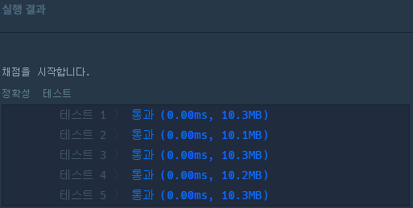

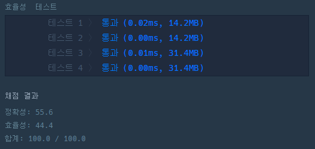

